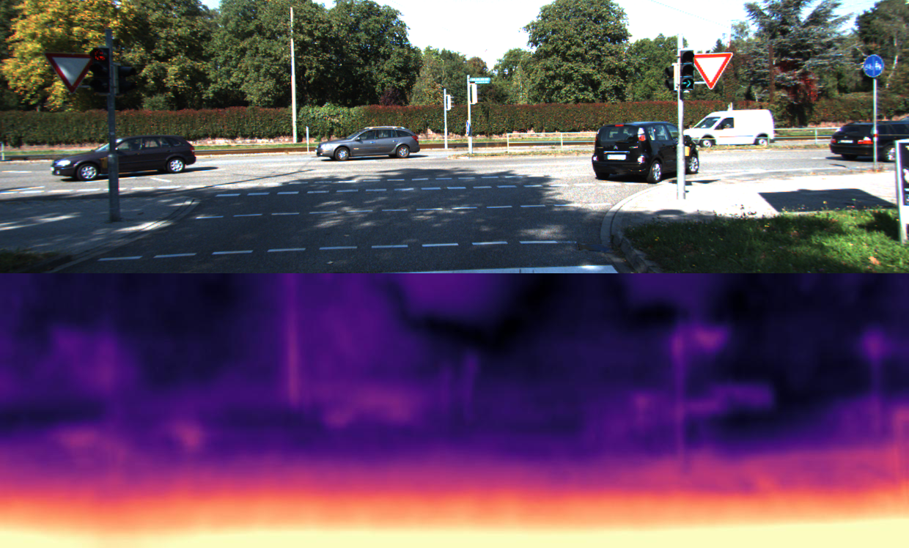

# Monocular depth estimation

Faculty project on the Machine learning course at Faculty of Mathematics.

This is our adapted PyTorch implementation for training and testing depth estimation models using the method described in

> [**Digging into Self-Supervised Monocular Depth Prediction**](https://arxiv.org/abs/1806.01260)
but using only mono camera.

## ⏳ Training
Using 314 photos, training lasted ~1.5h on Google Colab.
```shell
python3 train.py
```

## Datasets
We implemented classes for easier usage of KITTI data.

## Split
Data is splited into train, validation and test sets so the image path is stored in split folder.

## Networks
The network contains three parts: camera pose network, resnet encoder and depth decoder.

## Results
<p align="center">
  
</p>
